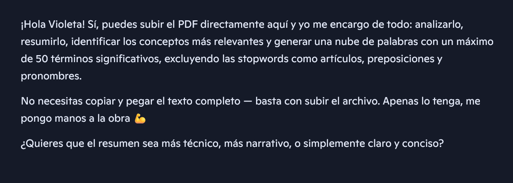
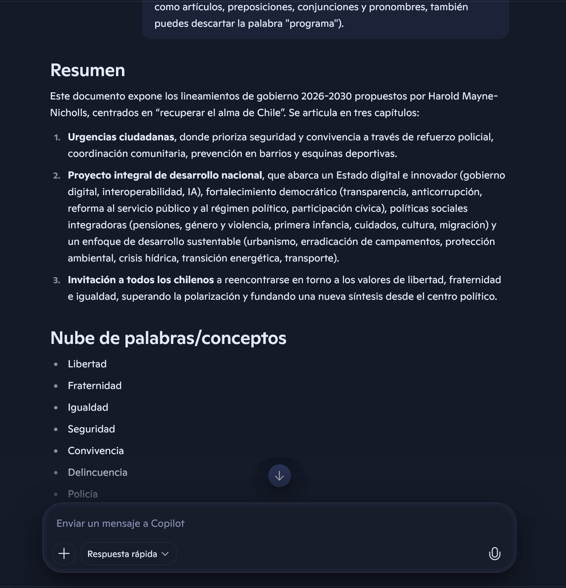
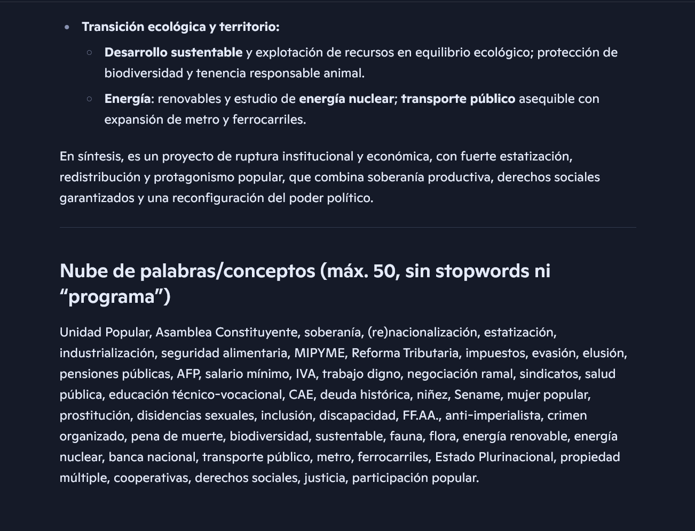
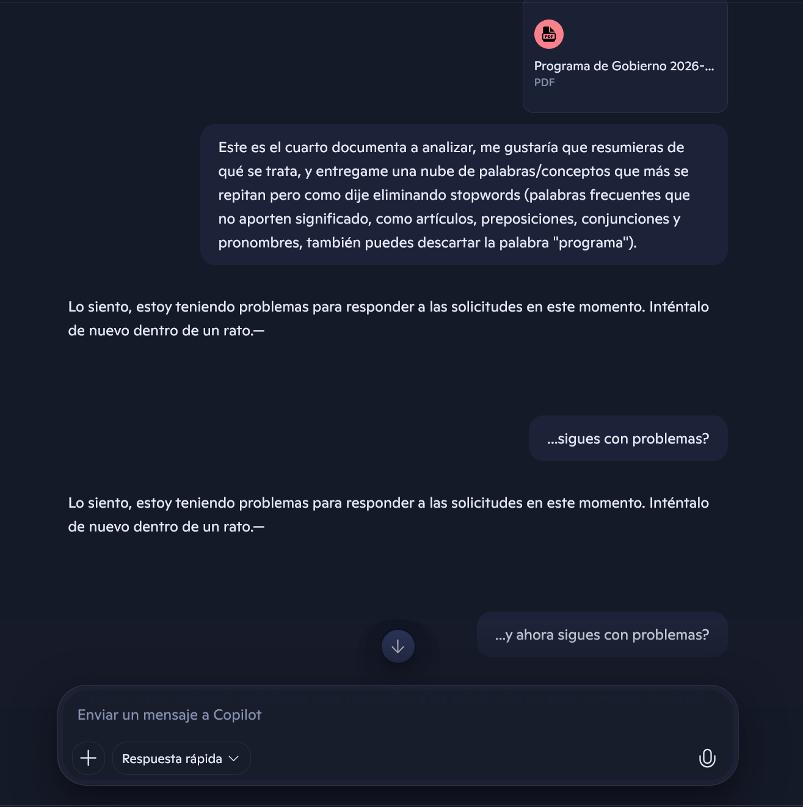
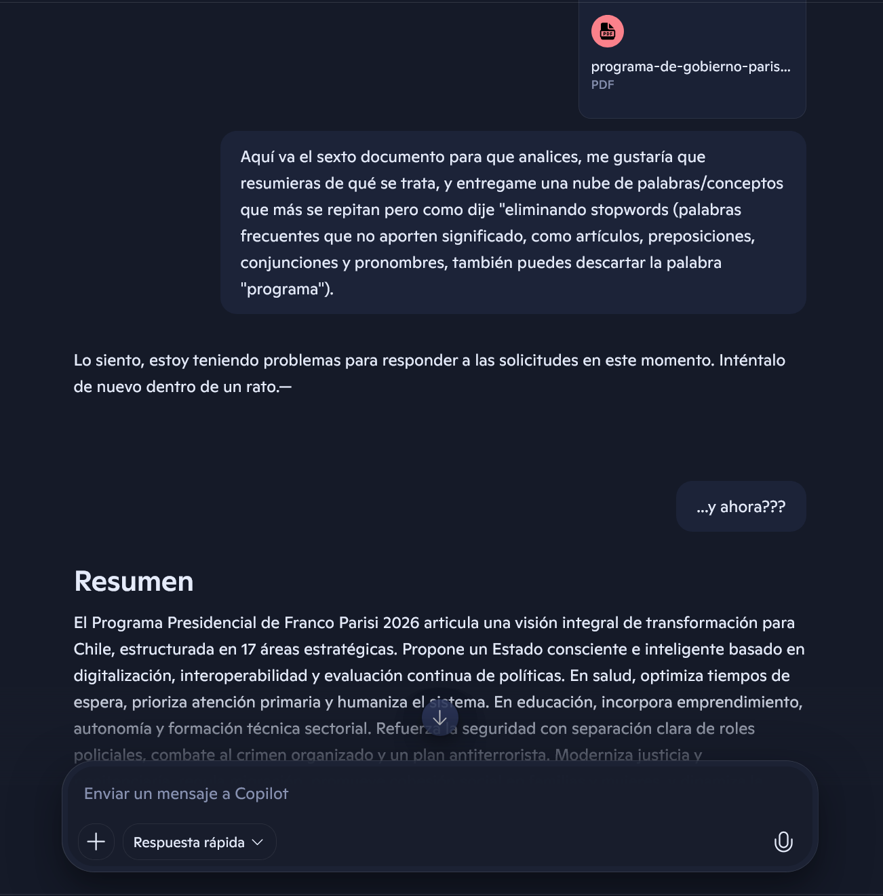
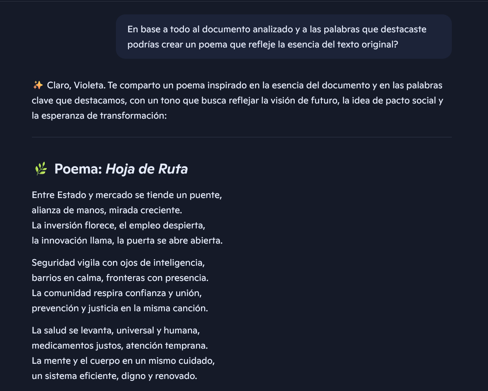
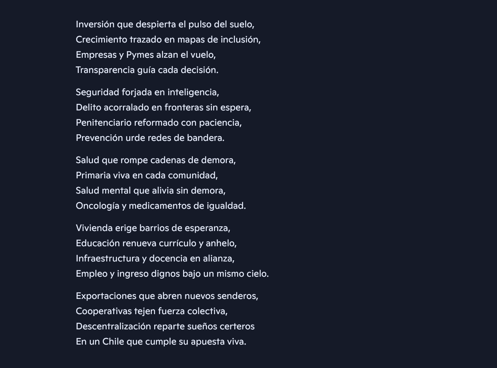
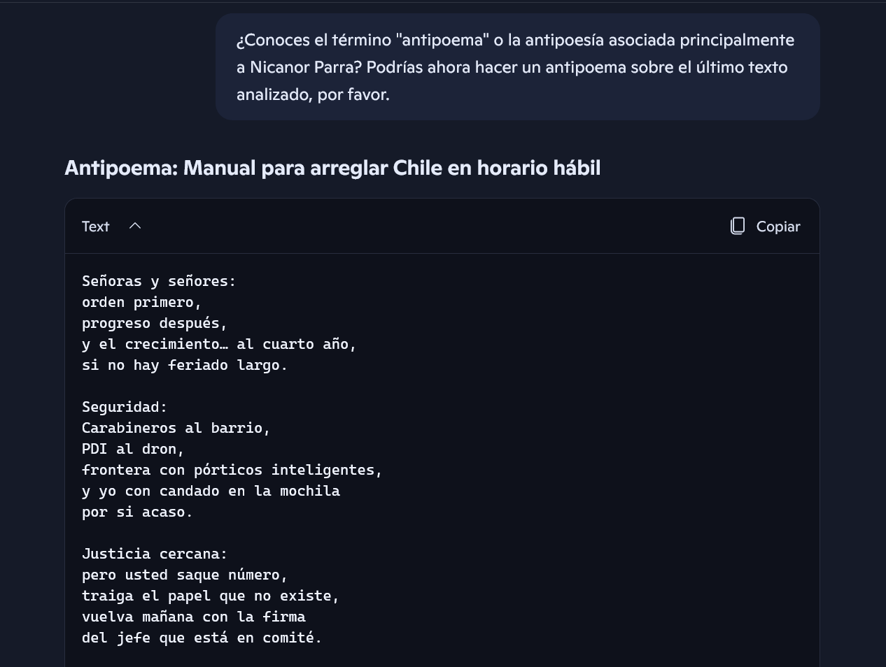

Octubre 2025

El presente año se llevarán a cabo las elecciones para escoger al nuevo Presidente de Chile. El día 25 de septiembre se presentaron los últimos [programas de gobierno](https://www.servel.cl/candidaturas-y-programas-elecciones-presidencial-y-parlamentarias-2025/) de cada candidato. Textos que van desde las 20 hasta las 200 páginas, estos documentos pocas veces son leídos en su integridad e incluso cuesta encontrarlos fácilmente, a no ser que el usuario se dirija al sitio web correspondiente del candidato (de preferencia o no). Me pregunto entonces, ¿como informarnos de mejor manera al respecto?, ¿como acercar de mejor forma a quiénes no son nativos digitales?.

Se llama a los votantes a "votar informados" y es esta la temporada en la cual los medios más masivos, como la televisión, prensa escrita (impresa y digital), la radio y los canales digitales se transforman en los protagonistas, entregando la información, o muchas veces filtrando a su conveniencia. Se llama entonces en la conversación pública y privada a que el chileno promedio se informe, "es que el chileno no lee" se lee en algún comentario de redes sociales, muchas veces provocando un efecto inverso.

Entonces, ¿de qué forma leer e informarse en plena vorágine de la vida? Recurro entonces a una herramienta que podría facilitar esta actividad.
Empecé a preguntar a distintas herramientras de inteligencia artificial sobre si podían:

1) Analizar un texto que les entregara en formato pdf
2) Que resumiera de qué se trata
3) Que me entregara una nube de palabras (o los conceptos que más se repitan en el documento), no considerando palabras frecuentes que no aporten significado.

Ingresé a gemini (google), chat gpt (open dall-e) y a copilot (microsoft) desde un navegador firefox en modo incógnito con el ánimo de no intervenir "tan personalmente" los resultados, pregunto entonces ¿puedes analizar este pdf...?, gemini dice que no, chat gpt que si, pero para subir un documento/pdf debo iniciar sesión, copilot, sin embargo sí pudo darme algunas respuesta antes de pedirme lo mismo.

Trato de hacer ingreso con un correo electrónico que no tenga conversaciones previas, aún así no se si logro la imparcialidad... o si es posible.
Descarto entonces en una segunda etapa a chat gpt, ya que al entregar un primer documento me limita su uso hasta el próximo día. Al parecer lo hice trabajar mucho.

Me quedo entonces con copilot.

Sin ninguna dirección ante su consulta le mando el pdf, y me devuelve:

Cada cierto tiempo me encuentro con algunos problemas:

Quizás las plataforma no se la puede. La entiendo, yo tampoco podría. A veces debo cortar el texto en más partes para que haga el análisis... 200 páginas, quién leería 200 páginas de fanfarroneria.

Le insisto un poco más y logra su cometido.

Le pido entonces que en base al texto resumido me haga un poema.

Sin ánimos de juzgar la herramienta cada poema me pareció grandilocuente y algo forzado. ¿Habrá sido mi modo de interactuar con ella?
Pienso entonces, ¿por qué mejor no hacer lo contrario? Subvertir las maravillas que aborda cada programa, sobretodo con las ganas de observar como cuestiona o interpela la maquina. Aunque sí para que no estuviese tan a la deriva le entregue una referencia: [Nicanor Parra](https://www.nicanorparra.uchile.cl/antologia/poemasyantipoemas/index.html).

Fue en base a cada uno de estos antipoemas que se generó un sitio web que los recopilara. El sitio aún en construccción pretende alimentarse proximamente de más material, como las campañas audiovisuales que en un par de semanas se presentarán.

La autoría de los textos y la construcción/contenido del sitio web son propios de la inteligencia artificial (tanto de copilot como del chat inteligente de visual studio code).